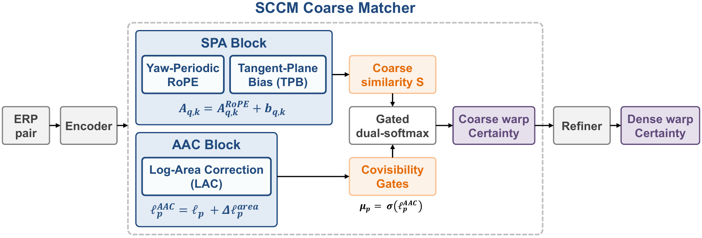

<div align="center">

# SCCM: Spherically Consistent Coarse Matching<br>for ERP Dense Feature Correspondence

**ACCV 2026**

Gyeonggwan Lee<sup>1,2</sup> · Eunsoo Im<sup>1</sup> · Seunghwan Hong<sup>1</sup> · Junghun Suh<sup>1</sup>

<sup>1</sup>Kakao Mobility Corp. &nbsp; <sup>2</sup>Korea University

[](https://gandanlee.github.io/sccm/)
[](paper/SCCM_ACCV2026.pdf)
[](paper/SCCM_ACCV2026_supplementary.pdf)
[](https://huggingface.co/gandan-lee/sccm)
[](#)
[](LICENSE)

**[Project Page](https://gandanlee.github.io/sccm/)** · **[Paper](paper/SCCM_ACCV2026.pdf)** · **[Supplementary](paper/SCCM_ACCV2026_supplementary.pdf)** · **[🤗 Hugging Face Models](https://huggingface.co/gandan-lee/sccm)**



</div>

SCCM makes the coarse stage of a dense matcher sphere-aware for 360° equirectangular (ERP) images. It corrects ERP's **topological** and **metric** distortion in the coarse attention logits (Spherical Positional Attention, SPA) and its **area** distortion in the covisibility gate (Area-Aware Covisibility, AAC), while keeping the RoMa V1 encoder, refiner, and loss unchanged.

## Results

PCK@1° (↑), angular error on the sphere.

| Method | Matterport3D<br>(indoor) | Stanford2D3D<br>(indoor, zero-shot) | Holo360D<br>(outdoor) |
|:---|:-:|:-:|:-:|
| RoMa V2<br>(perspective, zero-shot) | 0.040 | 0.043 | – |
| EDM<br>(ERP, released weights) | 0.163 | 0.104 | – |
| RoMa V1<br>(retrained on ERP) | 0.198 | 0.167 | 0.322 |
| Chart-naïve scaffold<br>(ours, no sphere priors) | 0.229 | 0.179 | 0.331 |
| **SCCM** | **0.275** | **0.229** | **0.357** |

The Holo360D column is after training on Holo360D from the Matterport3D checkpoints under one protocol. The chart-naïve → SCCM margin reproduces on three training seeds. Full results are in the [paper](paper/SCCM_ACCV2026.pdf) and on the [project page](https://gandanlee.github.io/sccm/).

## Installation

```bash
git clone https://github.com/gandanlee/sccm.git && cd sccm
pip install -e .
```

Tested with Python 3.10, PyTorch 2.5, CUDA 12.1. On macOS or other non-Linux platforms the CUDA local-correlation kernel is skipped and a built-in PyTorch implementation is used, so inference also runs on CPU.

## Pretrained models

SCCM weights are on **[Hugging Face: gandan-lee/sccm](https://huggingface.co/gandan-lee/sccm)**; see [`docs/CHECKPOINTS.md`](docs/CHECKPOINTS.md). The baseline rows (chart-naïve scaffold, ERP-retrained RoMa V1) are reproduced from their configs with `scripts/train.py`.

| Model | Setting | Hugging Face |
|:---|:-:|:-:|
| SCCM | Indoor<br>(Matterport3D) | [`mp3d/sccm.pth`](https://huggingface.co/gandan-lee/sccm/blob/main/mp3d/sccm.pth) |
| SCCM | Outdoor<br>(Matterport3D → Holo360D) | [`holo360d/sccm.pth`](https://huggingface.co/gandan-lee/sccm/blob/main/holo360d/sccm.pth) |

```bash
hf download gandan-lee/sccm --local-dir checkpoints
```

## Usage

Datasets are not redistributed; see [`docs/REPRODUCE.md`](docs/REPRODUCE.md#datasets) for sources, splits, and preparation.

```python
from sccm.build import get_model, load_config, load_checkpoint

model = get_model(load_config("configs/mp3d/sccm.yaml"))
load_checkpoint(model, "checkpoints/mp3d/sccm.pth")
model.cuda().eval()
```

```bash
# evaluation (Matterport3D test, indoor)
python scripts/eval_precision.py --config configs/mp3d/sccm.yaml \
    --checkpoint checkpoints/mp3d/sccm.pth \
    --data_root $SCCM_DATA_ROOT/matterport3d_megadepth --split test

# training (8 GPUs)
torchrun --nproc_per_node=8 scripts/train.py --config configs/mp3d/sccm.yaml \
    --num_steps 125000 --gpu_batch_size 1 --train_resolution medium
```

Each paper row has its own config (`configs/mp3d/`, `configs/holo360d/`), and [`docs/REPRODUCE.md`](docs/REPRODUCE.md) maps every table row to its config, command, and expected value.

## Citation

```bibtex
@inproceedings{lee2026sccm,
  title     = {{SCCM}: Spherically Consistent Coarse Matching for {ERP} Dense Feature Correspondence},
  author    = {Lee, Gyeonggwan and Im, Eunsoo and Hong, Seunghwan and Suh, Junghun},
  booktitle = {Asian Conference on Computer Vision (ACCV)},
  year      = {2026}
}
```

## Acknowledgements

This work builds on [RoMa](https://github.com/Parskatt/RoMa) and uses the [Matterport3D](https://niessner.github.io/Matterport/), [Stanford2D3D](http://buildingparser.stanford.edu/dataset.html), and [Holo360D](https://arxiv.org/abs/2604.22482) datasets. Code is released under the [MIT License](LICENSE).
